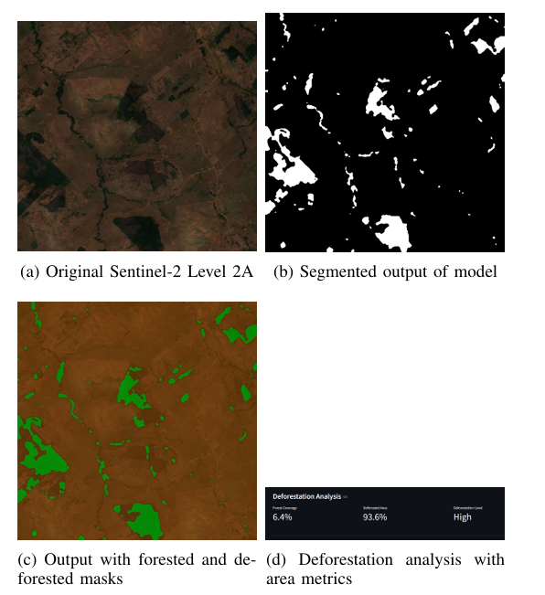
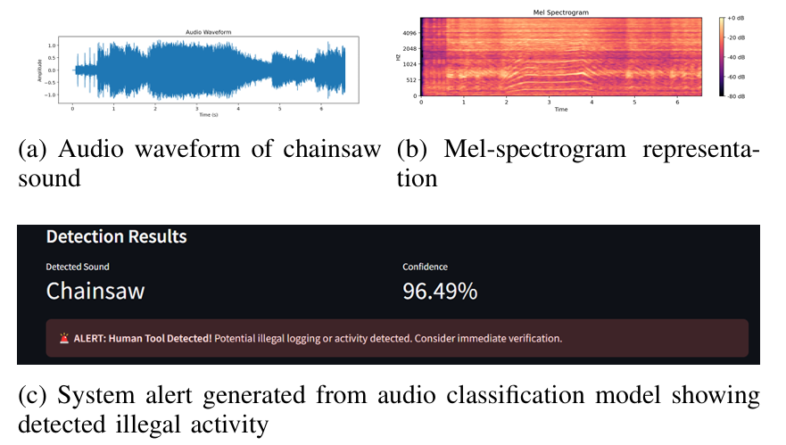
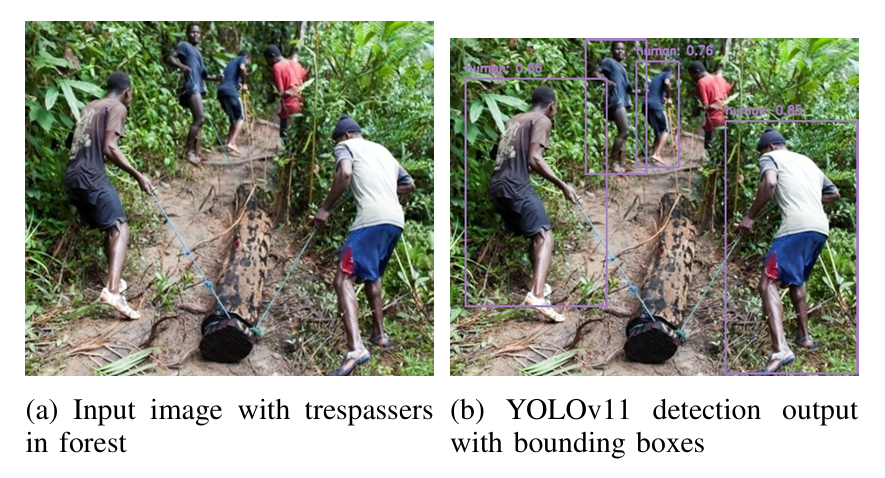

# Nature Nexus - Forest Surveillance System

## Overview

Nature Nexus is an advanced forest surveillance system designed to protect natural ecosystems through AI-powered monitoring. It combines multiple detection technologies to identify illegal activities, monitor deforestation, and detect potential threats to forest areas.

The application leverages:
- **Satellite Imagery Analysis** - Detects deforestation using segmentation models
- **Audio Surveillance** - Identifies unusual sounds like chainsaws, vehicles, and human activity
- **Object Detection** - Recognizes trespassers, vehicles, fires, and other threats

## Features

### 1. Deforestation Detection
- Analyzes satellite or aerial imagery to identify deforested areas
- Uses Attention U-Net segmentation model optimized with ONNX runtime
- Provides detailed metrics on forest coverage and deforestation levels
- Visualizes results with color-coded overlays



### 2. Forest Audio Surveillance
- Detects unusual sounds that may indicate illegal activities
- Classifies various sounds including:
  - **Human Sounds**: Footsteps, coughing, laughing, breathing, etc.
  - **Tool Sounds**: Chainsaw, hand saw
  - **Vehicle Sounds**: Car horn, engine, siren
  - **Other Sounds**: Crackling fire, fireworks
- Supports both uploaded audio files and real-time recording



### 3. Object Detection
- Identifies potential threats using YOLOv11 model
- Detects objects including:
  - Humans (trespassers)
  - Vehicles (cars, bikes, buses/trucks)
  - Fire and smoke
- Processes images, videos, and camera feeds
- Alerts on potential threats with confidence scores



## Getting Started

### Prerequisites

- Python 3.8+
- pip package manager
- Virtual environment (recommended)

### Installation

1. Clone the repository
```bash
git clone https://github.com/yourusername/nature-nexus.git
cd nature-nexus
```

2. Create and activate a virtual environment (optional but recommended)
```bash
python -m venv venv
source venv/bin/activate  # On Windows, use: venv\Scripts\activate
```

3. Install required dependencies
```bash
pip install -r requirements.txt
```

4. Download models
```bash
# Create models directory if it doesn't exist
mkdir -p models

```

### Running the Application

Launch the Streamlit application:
```bash
streamlit run app.py
```

The application will open in your default web browser at http://localhost:8501

## Model Architecture

### Deforestation Detection Model
- **Architecture**: Attention U-Net
- **Input**: Satellite/aerial imagery (RGB)
- **Output**: Binary segmentation mask (forest vs. deforested)
- **Optimization**: ONNX runtime for faster inference

### Audio Classification Model
- **Architecture**: Convolutional Neural Network (CNN)
- **Input**: Audio spectrograms
- **Output**: 14 sound classes with confidence scores
- **Features**: Mel-spectrogram analysis

### Object Detection Model
- **Architecture**: YOLOv11
- **Input**: Images/video frames
- **Output**: Bounding boxes, class labels, confidence scores
- **Classes**: Humans, vehicles, fire, smoke, etc.

## System Architecture

```
nature-nexus/
│
├── app.py                  # Main Streamlit application
├── prediction_engine.py    # Deforestation model interface
│
├── utils/
│   ├── audio_model.py      # Audio classification model
│   ├── audio_processing.py # Audio preprocessing utilities
│   ├── helpers.py          # Helper functions for visualization
│   ├── model.py            # U-Net model definition
│   ├── onnx_converter.py   # Converts PyTorch models to ONNX
│   ├── onnx_inference.py   # YOLO object detection inference
│   └── preprocess.py       # Image preprocessing utilities
│
└── models/                 # Model weights (not included in repo)
    ├── deforestation_model.onnx
    ├── best_model.pth      # Audio model
    └── best_model.onnx     # YOLO model
```

## Usage Guide

### Deforestation Detection
1. Select "Deforestation Detection" from the sidebar
2. Upload satellite or aerial imagery of forest areas
3. View segmentation results showing forest vs. deforested areas
4. Analyze metrics including forest coverage and deforestation level

### Audio Surveillance
1. Select "Forest Audio Surveillance" from the sidebar
2. Choose between uploading audio files or recording live audio
3. Submit the audio for analysis
4. View detected sound classification and potential alerts

### Object Detection
1. Select "Object Detection" from the sidebar
2. Choose between image, video, or camera feed
3. Adjust confidence and IoU thresholds as needed
4. Upload or capture input for processing
5. View detection results with bounding boxes and confidence scores

## Custom Model Training

To train custom models for your specific forest environment:

### Deforestation Model
```bash
# Convert trained PyTorch model to ONNX
python -m utils.onnx_converter models/your_pytorch_model.pth models/deforestation_model.onnx [input_size]
```

### Audio Model
Train on your custom audio dataset and replace the model file at `models/best_model.pth`

### YOLO Model
Train on your custom object dataset and replace the model file at `models/best_model.onnx`

## Troubleshooting

### Common Issues
- **Models not loading**: Ensure all model files exist in the `models/` directory
- **CUDA errors**: If using GPU, verify CUDA and cuDNN are correctly installed
- **Audio processing issues**: Check audio format compatibility (WAV, MP3, OGG)

## Contributing

Contributions are welcome! Please feel free to submit a Pull Request.

## License

This project is licensed under the MIT License - see the LICENSE file for details.
